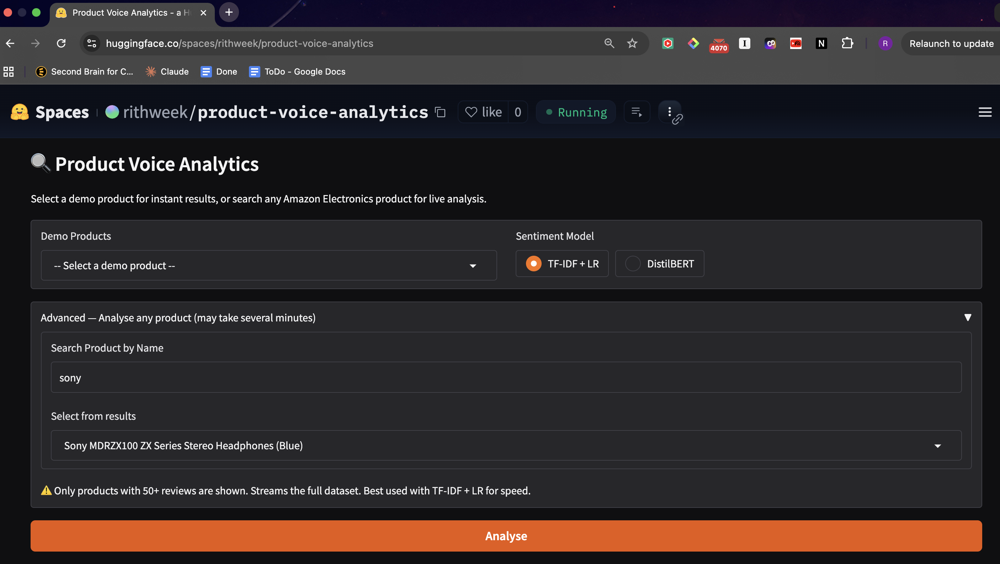
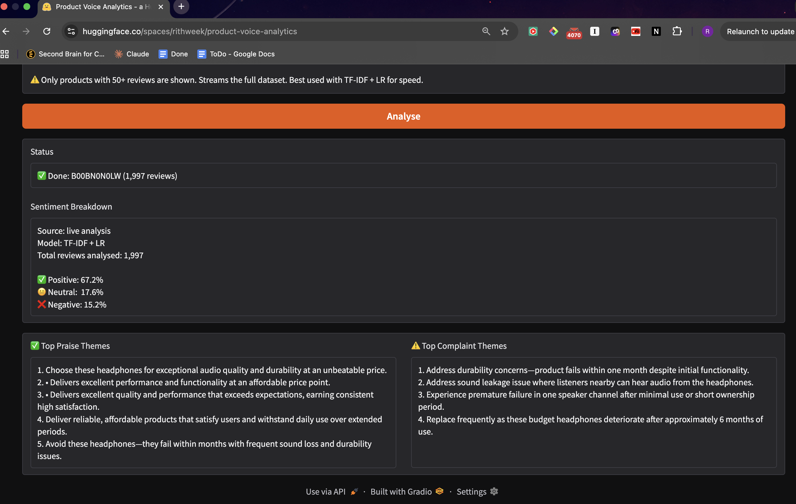

# Product Voice Analytics

Product teams spend hours reading reviews to understand what customers love or hate. This pipeline automates that: input a product name or ASIN, get a sentiment breakdown and top praise and complaint themes — distilled from thousands of reviews into plain-English bullets in seconds.

[](https://huggingface.co/spaces/rithweek/product-voice-analytics)
[](https://huggingface.co/rithweek/product-voice-analytics-models)

---

## Demo




> Live analysis takes 2-5 minutes on CPU (free HuggingFace tier). Screenshots above show a live pipeline result — use the Advanced search box to analyse any product by name or ASIN.

---

## What it does

- Classifies reviews as positive, neutral, or negative using two models — a TF-IDF + Logistic Regression baseline and a fine-tuned DistilBERT
- Clusters positive and negative reviews separately into topics using BERTopic and sentence-transformers embeddings
- Summarises each topic cluster into praise and complaint bullets via the Claude API
- Accepts product name or ASIN in the Advanced search box — ASIN is more precise for products with generic names
- Serves results through a Gradio app on HuggingFace Spaces with pre-computed cache for instant demo results and a live analysis path for any product

---

## Architecture

```
Raw Reviews (20M+ records, ~12GB)
        ↓
Reservoir Sampling → stratified 100K sample
        ↓
Preprocessing
(lowercase · strip HTML · remove special chars · remove stopwords)
        ↓
┌──────────────────────────────────────┐
│           Sentiment Layer            │
│  TF-IDF + Logistic Regression        │
│  DistilBERT (fine-tuned, 3-class)    │
└──────────────────────────────────────┘
        ↓
Topic Intelligence Layer
  → Split by sentiment (positive → praise path, negative → complaint path)
  → sentence-transformers embeddings (all-MiniLM-L6-v2)
  → BERTopic clustering
  → Claude API summarization
        ↓
Gradio App → HuggingFace Spaces
```

---

## Model Performance

**Counterintuitive result:** TF-IDF + Logistic Regression outperforms fine-tuned DistilBERT on macro-F1 for this dataset. Short, explicit product review text ("great cable, works perfectly") favours sparse feature models — DistilBERT's advantage shows up on ambiguous or longer-form text where contextual embeddings matter. The 3-star neutral class is particularly hard for DistilBERT because neutral Amazon reviews are linguistically similar to both positive and negative ones.

| Model | Accuracy | Macro-F1 | Inference (s/1k reviews) |
|---|---|---|---|
| TF-IDF + Logistic Regression | 0.8279 | 0.7278 | 0.04 |
| DistilBERT (fine-tuned) | 0.7849 | 0.5064 | 3.29 |

DistilBERT was trained for 10 epochs (LR=2e-5, batch=64) with best checkpoint saved at epoch 6 (val_loss=0.5908, val_F1=0.4933).

---

## Stack

- **Data** — Amazon Electronics reviews (McAuley et al., UCSD), 20M+ records
- **Sampling** — reservoir sampling for memory-bounded single-pass loading
- **Classical ML** — scikit-learn TF-IDF vectorizer + Logistic Regression
- **Deep Learning** — HuggingFace Transformers, DistilBERT fine-tuned for sequence classification
- **Topic Modeling** — BERTopic, sentence-transformers (all-MiniLM-L6-v2)
- **LLM** — Claude API (claude-haiku) for bullet summarization
- **Storage** — Parquet + DuckDB for fast ASIN-based review retrieval
- **App** — Gradio, HuggingFace Spaces
- **Model hosting** — HuggingFace Hub

---

## Project Structure

```
product-voice-analytics/
├── app.py                          # entry point (HuggingFace Space)
├── app/
│   ├── artifacts.py                # downloads models from HF Hub at startup
│   ├── handlers.py                 # analyse() and format_results()
│   ├── search.py                   # DuckDB product search and ASIN resolution
│   └── ui.py                       # Gradio UI components and event bindings
├── src/
│   ├── config.py                   # all constants and paths
│   ├── utils.py                    # review retrieval via DuckDB + Parquet
│   ├── pipeline/
│   │   ├── sampling.py             # reservoir sampling
│   │   ├── preprocess.py           # text cleaning pipeline
│   │   └── sentiment.py            # model loading and inference
│   └── intelligence/
│       ├── clustering.py           # embeddings + BERTopic
│       └── summarizer.py           # Claude API summarization
├── notebooks/
│   ├── 01_data_exploration.ipynb
│   ├── 02_baseline_model.ipynb
│   ├── 03_distilbert_finetune.ipynb
│   ├── 04_model_comparison.ipynb
│   └── 05_topic_intelligence.ipynb
├── tests/
│   └── test_pipeline.py
└── requirements.txt
```

---

## Notebooks

| Notebook | Description |
|---|---|
| 01_data_exploration | Dataset structure, label distribution, review length analysis |
| 02_baseline_model | TF-IDF vectorization, Logistic Regression training, evaluation |
| 03_distilbert_finetune | DistilBERT fine-tuning with best checkpoint saving, loss curves |
| 04_model_comparison | Side-by-side accuracy, macro-F1, and inference speed comparison |
| 05_topic_intelligence | BERTopic clustering, embedding visualisation, Claude summarization |

---

## Key Design Decisions

**Reservoir sampling over load-then-sample** — the raw file is 12GB and won't fit in memory. Reservoir sampling reads the file once in a single pass and maintains a fixed-size sample with guaranteed statistical properties, making it memory-bounded regardless of dataset size.

**TF-IDF wins on macro-F1** — DistilBERT underperforms on the neutral class (3-star reviews) because neutral Amazon reviews are linguistically ambiguous. TF-IDF's explicit feature representation handles the class boundary more cleanly on short product text.

**Sentiment-split clustering** — the naive approach sends all reviews to BERTopic regardless of sentiment, then asks Claude to extract complaint themes from clusters that may be entirely positive. Instead, positive and negative reviews are split by sentiment label before clustering — praise path gets positive reviews, complaint path gets negative ones. This ensures Claude always summarizes the right sentiment group.

**Parquet + DuckDB over streaming** — the original implementation streamed the full 12GB JSON line by line to find reviews for a given ASIN, taking 10+ minutes. Converting to Parquet and querying with DuckDB reduces this to sub-second lookup via columnar storage and predicate pushdown.

**Pre-computed cache for demo** — running the full pipeline live takes several minutes on CPU. The app pre-computes results for the top products and serves them instantly, with the live pipeline available for any other product.

**Modular app structure** — `app/` is split into `artifacts.py`, `handlers.py`, `search.py`, and `ui.py` with single responsibilities. `app.py` at root is a thin entry point that wires them together — required by HuggingFace Spaces.

---

## Known Limitations

- **Demo dropdown and Advanced search are independent** — selecting a product from the demo dropdown and also having a search result selected will prioritise the search result. Clear the search dropdown before using demo products to avoid confusion.
- **Live pipeline runs on CPU** — analysis takes 2-5 minutes depending on review volume. Pre-computed cache products load instantly.
- **50 review minimum** for topic clustering — products with fewer reviews return sentiment breakdown only.

---

## Running Locally

```bash
git clone https://github.com/pr-rithwik/product-voice-analytics.git
cd product-voice-analytics
pip install -r requirements.txt
```

Set environment variables:
```bash
export ANTHROPIC_API_KEY=your_key
export MODELS_DIR=/path/to/models
```

Run:
```bash
python app.py
```

Models download automatically from HuggingFace Hub on first run.

---

## Data

The raw dataset is not included in this repo. Download from the [UCSD Amazon Reviews dataset](https://cseweb.ucsd.edu/~jmcauley/datasets/amazon/links.html):
- `Electronics.json.gz` — reviews
- `meta_Electronics.json.gz` — product metadata

Place both in `data/raw/`.